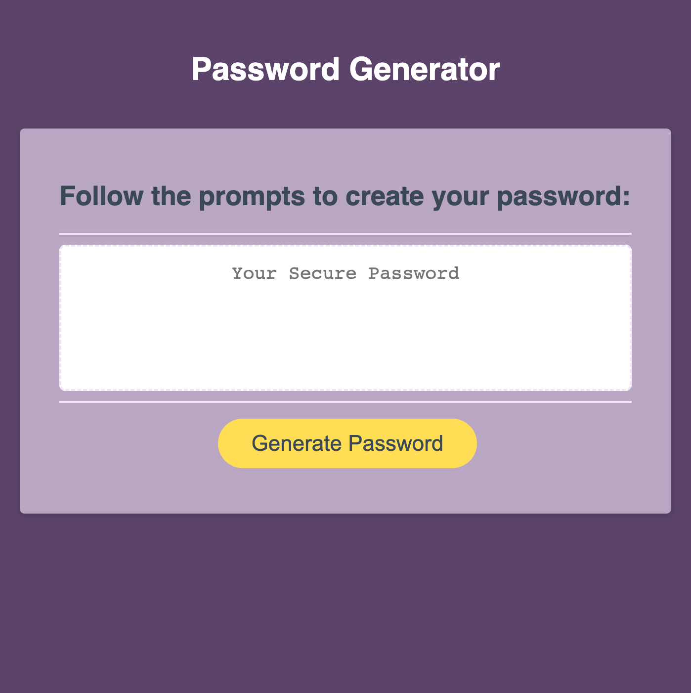

# caput-draconis-password-generator
Password Generator (JavaScript)

## Description 

 Caput Draconis is a password generator designed to match to the User's desire for a totally unique and secure password. Users have control over what types of characters will be included and the length of characters that will be used. This project is named "Caput Draconis" after the beloved Lady In The Painting from Harry Potter who holds the password to Gryffindoor Commons. The generator draws from four character types: special characters (supplied by Open Web Application Security Project® or OWASP), numeric characters, upper-, and lowercase letters.
 
 The motivation behind this project was to design an easy way for users to generate entirely randomized passwords in just a few clicks. Each character type is equitably represented from the menu of character types  the user selects to include in their customized password, ensuring that even though there are significantly more letters than numbers to choose from, each character type has an equal chance of appearing in the password. This password generator is designed as a tool to help Users no longer have to waste time inventing passwords on their own, and it also solves the problem and very real cyber security risk of using a predictable password. 
 
 In developing this random password generator, I learned how important it is to be explicit while coding so the program will respond with precision each time it is used. I also learned to be wary of potential ways that code can break - whether it be by incorrect inputs by the user or getting lost in recursion. One of the most important takeaways I have from approaching this project is that there is always more that can be done: streamlining code, adding features, and adding other inventive ideas.

## Installation 

 N/A. [Deployed site here!](https://miacias.github.io/caput-draconis-password-generator)
 

## Usage 

 1. Click the "Generate Password" button on the screen.
 2. Follow the prompts in the pop-up windows to provide the generator information on what to include in the new password and how long it is to be.
    - "Ok" on a Character Question means to include something
    - "Cancel" on a Character Question to not include something
 3. A password will appear in the box to record in a safe location, such as an offline notebook.
 4. It is possible to solicit multiple passwords with new (or same) criteria each time the "Generate Password" button is clicked and the prompts are completed. 
    - NOTE: For security reasons, pevious passwords will disappear from the text box when a new password is created, so be sure to record offline before generating a new password.

    

## Features 

 - Calculates password from 1 to 4 different character types regardless of how many character types are set to be included or the set password length
 - Can be used multiple times to create infinite iterations of unique, case-sensitive passwords
 - Supports fail cases such as if the user decides to cancel password generation after the first prompt or if the user accidentally inputs something other than a number for password length

## Roadmap

 I am working through a series of weekly projects and hope to return to this one, though I may not have the time to come back to this project. Here are some of the desired features I would like to add in the future in no particular order:

 - A readout summarizing user specifications after the generated password prints to the page (i.e. set password length and characters included and excluded)
 - An option to run the generator again with duplicate selections (to skip repetition of setup prompts and confirm messages)
 - A customization of prompt button names from "OK, Cancel" to more fitting words via jQuery - OR adapting the generator prompt/confirm messages into a form so as to be less invasive to User experience
 - An event listener that copies the textbox readout of the generated password to clipboard on click

## Credits 

 Documentation referenced: 

 - Mozilla Developer Network (JavaScript)
 - Slack Overflow forums
 - U. Penn Bootcamp study groups
 - Samantha Ing: https://www.samanthaming.com/tidbits/21-how-to-test-nan/

## License 

Please refer to the LICENSE in the repo.